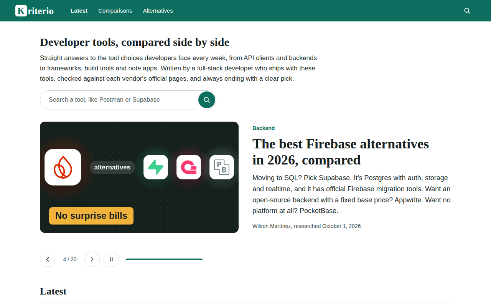
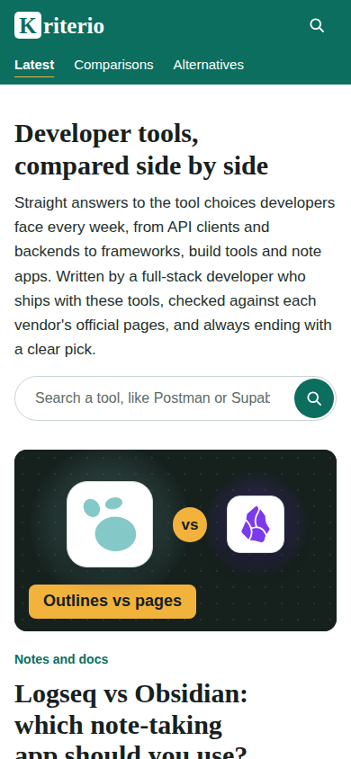
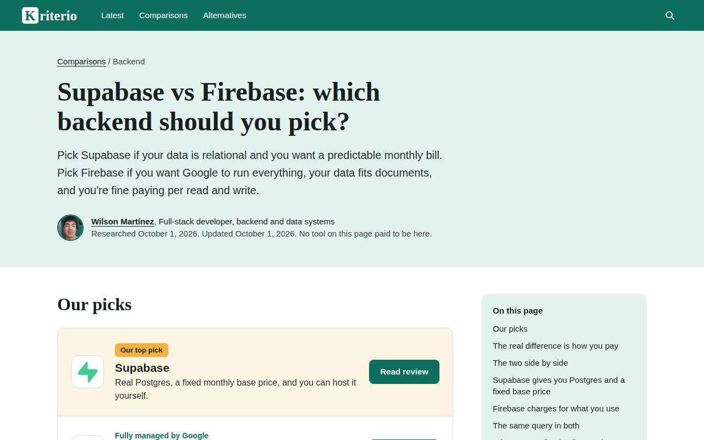
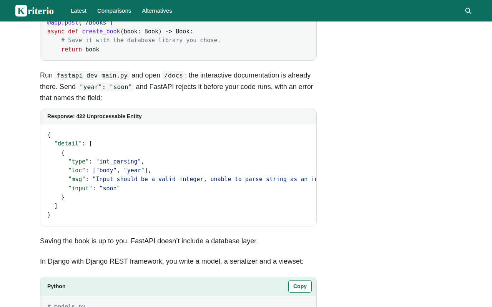
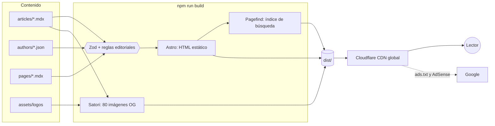

<p align="center">
  
</p>

<p align="center">
  <strong>Comparativas independientes de herramientas para desarrolladores.</strong><br>
  Escritas por un desarrollador en activo, verificadas en fuentes oficiales y siempre con una recomendación clara.
</p>

<p align="center">
  <a href="https://astro.build"></a>
  <a href="https://www.typescriptlang.org"></a>
  <a href="https://nodejs.org"></a>
  <a href="https://pagefind.app"></a>
  <a href="https://workers.cloudflare.com"></a>
</p>

<p align="center">
  
  
  
  
  
</p>

---

## Contenido

- [Qué es Kriterio](#qué-es-kriterio)
- [Vista previa](#vista-previa)
- [Características](#características)
- [Stack](#stack)
- [Arquitectura](#arquitectura)
- [Estructura del proyecto](#estructura-del-proyecto)
- [Empezar](#empezar)
- [Variables de entorno](#variables-de-entorno)
- [Escribir un artículo](#escribir-un-artículo)
- [Controles de calidad en el build](#controles-de-calidad-en-el-build)
- [Rendimiento](#rendimiento)
- [Seguridad](#seguridad)
- [SEO](#seo)
- [Anuncios y cumplimiento de AdSense](#anuncios-y-cumplimiento-de-adsense)
- [Despliegue](#despliegue)
- [Documentación](#documentación)
- [Autor](#autor)

---

## Qué es Kriterio

[Kriterio](https://kriterio.dev) responde las decisiones de herramientas que un desarrollador toma cada semana: clientes de API, backends, frameworks, herramientas de build y apps de notas.

Cada artículo sigue el mismo estándar editorial:

| | |
|---|---|
| **Veredicto primero** | Quién gana y para quién, antes de cualquier tabla |
| **Fuentes oficiales** | Precios, límites y licencias tomados de las páginas de cada proveedor, todos enlazados |
| **Experiencia real** | Recomendaciones en primera persona de quien usa estas herramientas en proyectos de clientes |
| **Código que funciona** | Ejemplos basados en la documentación oficial, con botón para copiar |
| **Independencia** | Ninguna herramienta paga por aparecer; el sitio se financia con anuncios |

Hoy publica **20 artículos** en cinco temas: API clients, Backend, Frontend and tooling, Mobile y Notes and docs.

---

## Vista previa

<table>
  <tr>
    <td width="68%"></td>
    <td width="32%"></td>
  </tr>
  <tr>
    <td></td>
    <td></td>
  </tr>
</table>

---

## Características

**Lectura**
- Veredicto arriba con `<Picks>`, tabla comparativa, una sección por herramienta, "How to choose in 30 seconds" y FAQ.
- Índice lateral en escritorio y desplegable en móvil.
- Bloques de código estilo W3Schools: etiqueta de lenguaje, botón **Copy** y recuadro `<Output>` con el resultado.
- Búsqueda estática con Pagefind: funciona sin servidor y sin enviar datos a terceros.

**Portada**
- Carrusel con todos los artículos. Rota cada 7 s, empieza en uno al azar, se pausa con el mouse, el foco o un botón, y se queda quieto con `prefers-reduced-motion`.
- Filtro por tema sin recargar la página. Sin JavaScript, todo sigue visible.

**Imágenes generadas por código**
- Portadas 16:9 con los logos oficiales, un halo del color de cada marca y un gancho de 2 a 4 palabras.
- 80 imágenes para redes y Google Discover, generadas en el build con Satori: 1.91:1, 16:9, 4:3 y 1:1.
- Sin fotos de stock ni imágenes hechas con IA.

**Preparado para crecer**
- i18n listo: inglés en `/` y español en `/es/` con `hreflang`. El español se activa con una línea.
- Las secciones vacías no aparecen en el menú hasta tener artículos.

---

## Stack

| Capa | Tecnología |
|---|---|
| Framework | [Astro 7](https://astro.build) (sitio 100 % estático) + MDX |
| Lenguaje | TypeScript en modo estricto |
| Contenido | Content Collections con esquemas Zod |
| Estilos | CSS propio con tokens de diseño, sin frameworks ni UI kits |
| Tipografía | Public Sans y Newsreader, servidas desde el propio dominio |
| Código en artículos | Shiki, tema `github-light-high-contrast` (WCAG AA) |
| Imágenes sociales | Satori + resvg |
| Búsqueda | Pagefind |
| Hosting | Cloudflare Workers (static assets) |
| Monetización | Google AdSense |

---

## Arquitectura

Todo se resuelve al compilar. En producción no hay servidor, base de datos ni API: solo HTML, CSS, un poco de JavaScript y las imágenes.



---

## Estructura del proyecto

```text
.
├── articulos/              Borradores, plan del sitio e informe de verificación
├── docs/
│   ├── despliegue.md       Cloudflare, lanzamiento y reglas de AdSense
│   ├── escribir-articulos.md
│   └── assets/             Imágenes de este README
├── public/
│   ├── _headers            Headers de seguridad y caché
│   └── robots.txt
├── src/
│   ├── components/
│   │   ├── article/        Autor, fuentes, "How we researched"
│   │   └── mdx/            Componentes de los artículos: Picks, Results, CodeBlock, Output…
│   ├── content/
│   │   ├── articles/en/    Un .mdx por artículo
│   │   ├── authors/        Perfil del autor
│   │   └── pages/en/       About, Contact, Privacy, Terms, How we test
│   ├── i18n/ui.ts          Textos de interfaz (en / es)
│   ├── layouts/            BaseLayout: SEO, JSON-LD, AdSense
│   ├── lib/                Rutas, artículos, anuncios, colores de marca, imágenes OG
│   ├── pages/              Rutas: artículos, secciones, búsqueda, RSS, ads.txt, /og
│   ├── styles/global.css   Tokens de diseño y estilos base
│   └── views/              Portada, artículo, sección, búsqueda, páginas
├── astro.config.mjs
├── wrangler.jsonc          Configuración de Cloudflare
└── DESIGN.md               Sistema de diseño
```

---

## Empezar

**Requisito:** Node.js 22.12 o superior.

```sh
git clone https://github.com/rslcia11/monetizacion-web.git
cd monetizacion-web
npm install
npm run dev
```

Abre <http://localhost:4321>. Los cambios en artículos y componentes se ven al instante.

| Comando | Qué hace |
|---|---|
| `npm run dev` | Servidor de desarrollo. Incluye los artículos con `draft: true` |
| `npm run check` | Tipos y esquemas de contenido |
| `npm run build` | Sitio estático en `dist/` + índice de búsqueda |
| `npm run preview` | Sirve `dist/` como en producción. La búsqueda solo funciona aquí |

---

## Variables de entorno

Todas son opcionales. Sin ellas, el sitio funciona completo y no muestra ningún anuncio ni espacio vacío.

| Variable | Ejemplo | Para qué sirve |
|---|---|---|
| `PUBLIC_INDEXABLE` | `false` | Con `false`, todas las páginas llevan `noindex`. Úsalo para probar en producción antes del lanzamiento |
| `ADSENSE_CLIENT` | `ca-pub-1234567890123456` | Activa AdSense y genera `/ads.txt` |
| `ADSENSE_SLOT_ARTICLE` | `1234567890` | Anuncio dentro del artículo |
| `ADSENSE_SLOT_SIDEBAR` | `1234567890` | Anuncio fijo de la barra lateral (300×600, solo escritorio) |
| `ADSENSE_SLOT_HOME` | `1234567890` | Anuncio de la portada |

El build falla si algún ID no tiene el formato exacto que entrega AdSense, para que nunca se publique un valor mal copiado.

---

## Escribir un artículo

Un artículo es un solo archivo en `src/content/articles/en/<slug>.mdx`. El nombre del archivo es la URL.

```yaml
---
title: "Supabase vs Firebase: which backend should you pick?"   # máx. 70
description: Supabase is Postgres with a flat monthly fee...    # 50–160
lede: Pick Supabase if your data is relational...
kind: comparison            # comparison | alternatives | guide
method: research            # research | tested
topic: Backend
hook: "SQL vs NoSQL"        # 2–4 palabras para la imagen
tools: [Supabase, Firebase]
author: wilson-martinez
publishedAt: 2026-10-01
updatedAt: 2026-10-01
testedAt: 2026-10-01
testing: { environment: "...", versions: [{ tool: Supabase, version: "..." }] }
sources:
  - { title: "Supabase pricing", url: "https://supabase.com/pricing" }
---
```

La portada, la imagen para redes, el índice, la sección de método, las fuentes y la caja del autor se generan solos. La guía completa, con todos los componentes, está en [`docs/escribir-articulos.md`](docs/escribir-articulos.md).

---

## Controles de calidad en el build

Si algo no cumple, `npm run build` falla con un mensaje que dice qué corregir. Nada roto llega a producción.

| Control | Regla |
|---|---|
| Esquema | Frontmatter completo, largos de título y descripción, fechas coherentes, URLs solo `http(s)` |
| Enlaces internos | Cada `href="#..."` de `<Picks>` apunta a un título que existe |
| Componentes | `<Results>` con un valor por herramienta; `<ProsCons>` con al menos un pro y un contra |
| Anuncios | Máximo 3 por artículo, nunca seguidos, nunca antes del veredicto, nunca pegados a código, `<Picks>` u `<Output>` |
| Rutas | Un artículo no puede usar la URL de una página del sitio |
| Traducciones | Falta un texto de interfaz → error de tipos |
| Páginas legales | El pie de página nunca enlaza a una página que no existe |
| AdSense | IDs con el formato exacto de Google |

---

## Rendimiento

Medido con Lighthouse en modo celular (procesador 4 veces más lento y 4G lenta):

| Página | Performance | Accessibility | Best Practices | SEO | LCP | TBT | CLS | Peso |
|---|---|---|---|---|---|---|---|---|
| Portada | **100** | **100** | **100** | **100** | 1.2–1.4 s | 0–20 ms | 0 | 111 KB |
| Artículo | **100** | **100** | **100** | **100** | 1.1 s | 0 ms | 0 | 62 KB |

Cómo se logra:
- HTML estático y CSS en línea (~5 KB comprimido): el primer pintado no espera ninguna petición.
- El carrusel carga solo la portada visible y la siguiente; las demás esperan en un `<template>`.
- `content-visibility: auto` en la cuadrícula: lo que está fuera de pantalla no se pinta.
- Animaciones solo con `transform` y `opacity`, en su propia capa de GPU.
- Imágenes optimizadas en el build, con tamaño reservado para que nada salte.
- Fuentes propias con `font-display: swap` y precarga.
- Caché de un año para los recursos con hash.

---

## Seguridad

| Medida | Detalle |
|---|---|
| Dependencias | `npm audit`: 0 vulnerabilidades |
| HSTS | Dos años, `includeSubDomains`, `preload` (y `.dev` ya está en la lista de precarga) |
| CSP | `object-src 'none'`, `base-uri 'self'`, `form-action 'self'`, `frame-ancestors 'self'`, `upgrade-insecure-requests` |
| Clickjacking | `X-Frame-Options: SAMEORIGIN` |
| Otros headers | `nosniff`, `Referrer-Policy`, `Permissions-Policy`, `COOP: same-origin-allow-popups` |
| Inyección | JSON-LD escapado; resultados de búsqueda copiados como texto desde un `<template>` inerte |
| Superficie de ataque | Sin servidor, sin base de datos, sin formularios que guarden datos, sin cuentas de usuario |

---

## SEO

- URL corta por tema y una sola forma canónica (con barra final).
- `<title>`, descripción y URL canónica únicos por página.
- Datos estructurados: `Article` (con imagen en 16:9, 4:3 y 1:1), `BreadcrumbList`, `Organization` y `Person` del autor con `sameAs`.
- Open Graph y Twitter Cards con imágenes de 1200 px.
- `max-image-preview:large` para Google Discover.
- Sitemap, `robots.txt`, RSS y `hreflang` preparado.
- Búsqueda interna con `noindex` y fuera del sitemap.
- E-E-A-T: autor real con foto, bio, enlaces verificables, fechas visibles y fuentes oficiales.

---

## Anuncios y cumplimiento de AdSense

Implementado según las [políticas del programa](https://support.google.com/adsense/answer/48182) y las [políticas de ubicación](https://support.google.com/adsense/answer/1346295):

- Etiqueta exacta **"Advertisements"**.
- El script de AdSense se carga solo en la portada y en los artículos. Nunca en 404, búsqueda ni páginas legales.
- 48 px de espacio libre alrededor del anuncio del artículo, lejos de botones y enlaces.
- Anuncio fijo solo en escritorio, de 300 px de ancho y sin tapar contenido.
- Sin pop-ups, intersticiales ni textos que inviten a hacer clic.
- Política de privacidad con cookies de Google, opciones de exclusión y consentimiento para EEE, Reino Unido, Suiza y EE. UU.

Lo que se configura en la cuenta (consentimiento, anuncios automáticos, monitoreo de CTR y tráfico inválido) está en [`docs/despliegue.md`](docs/despliegue.md#reglas-de-adsense-cómo-no-ser-penalizado).

---

## Despliegue

El repositorio incluye `wrangler.jsonc` y `.node-version` para Cloudflare.

| Ajuste | Valor |
|---|---|
| Build command | `npm run build` |
| Deploy command | `npx wrangler deploy` |
| Antes del lanzamiento | `PUBLIC_INDEXABLE=false` |
| Lanzamiento | `PUBLIC_INDEXABLE=true` + enviar el sitemap en Search Console |

La guía paso a paso (dominio, Search Console, AdSense y checklist) está en [`docs/despliegue.md`](docs/despliegue.md).

---

## Documentación

| Documento | Contenido |
|---|---|
| [`DESIGN.md`](DESIGN.md) | Sistema de diseño: colores, tipografía, layout, componentes |
| [`docs/escribir-articulos.md`](docs/escribir-articulos.md) | Cómo escribir y publicar un artículo |
| [`docs/despliegue.md`](docs/despliegue.md) | Despliegue, lanzamiento y reglas de AdSense |
| [`articulos/plan-sitio-adsense.md`](articulos/plan-sitio-adsense.md) | Estrategia: nicho, keywords, calendario y estándar editorial |
| [`articulos/guia-calidad-articulos.md`](articulos/guia-calidad-articulos.md) | Cómo se investiga, se escribe y se aprueba cada artículo |
| [`articulos/informe-verificacion.md`](articulos/informe-verificacion.md) | Verificación de los 20 artículos contra fuentes oficiales |

---

## Autor

<table>
  <tr>
    <td width="96"></td>
    <td>
      <strong>Wilson Martínez</strong><br>
      Desarrollador full-stack, backend y sistemas de datos, en Loja, Ecuador.<br>
      <a href="https://github.com/rslcia11">GitHub</a> ·
      <a href="https://www.linkedin.com/in/wilson-martinez-50097a220/">LinkedIn</a>
    </td>
  </tr>
</table>

---

<p align="center">
  © 2026 Wilson Martínez. Todos los derechos reservados.<br>
  El código y el contenido de este repositorio no tienen licencia de uso abierta.<br>
  Los nombres y logos de las herramientas pertenecen a sus dueños y se usan solo para identificarlas.
</p>
